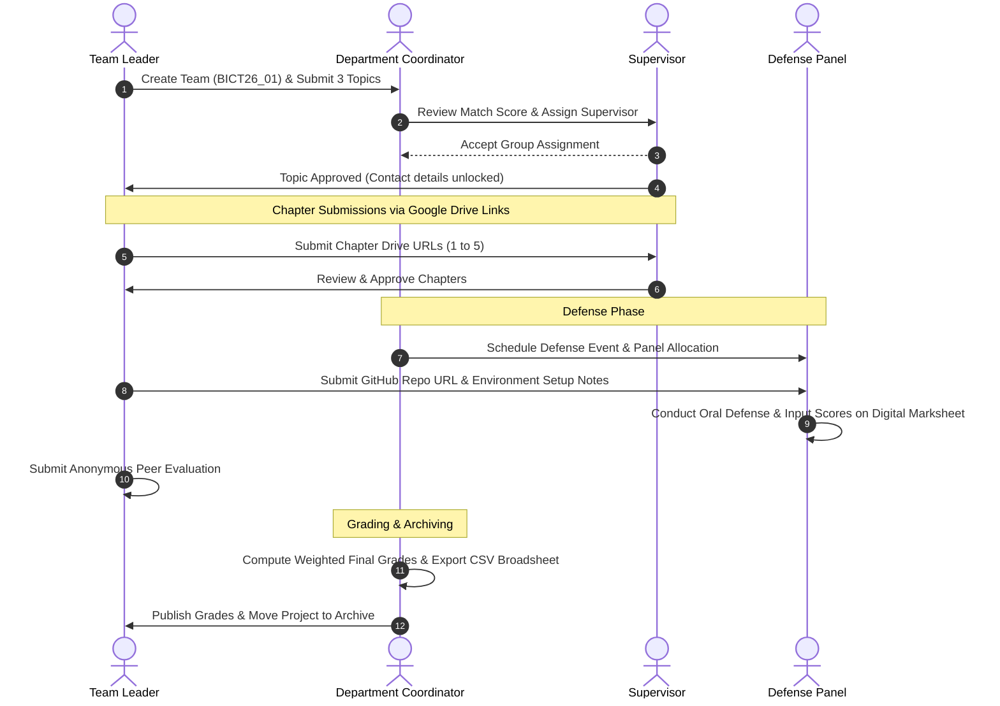

**FINAL YEAR PROJECT MANAGEMENT SYSTEM**

System Requirements & Technical Specification — Redraft v3 (Finalized Specification)

Ho Technical University

*Stack: Laravel 11 · React 18 · MySQL · Redis · Docker*

September 2026

# **1. System Overview**

The Final Year Project Management System is an online platform designed to digitize and streamline the entire project lifecycle at Ho Technical University. Currently, the process — from topic selection and supervisor assignment to defense grading and final documentation — is performed manually, leading to inefficiencies, miscommunication, and data loss. This system will automate workflows, enhance collaboration, and provide a centralized hub for all stakeholders: students, supervisors, defense panel examiners, and the Final Year Project Coordinator.

### **Core Objectives**

- Eliminate manual Excel inputs, paper grade sheets, and redundant administrative overhead
- Provide real-time visibility into project progress across academic chapters
- Enable fair and transparent supervisor allocation via automated match suggestions
- Support multi-evaluator defense scoring with customizable rubric weightings
- Incorporate peer contribution evaluation to resolve student "free-rider" disputes
- Simplify project deliverables management using external document links (Google Drive/OneDrive) and code repositories (GitHub/GitLab)
- Export official department broadsheets and grade reports in CSV, Excel (.xlsx), and PDF formats
- Maintain a searchable digital repository of completed final year projects

# **2. User Personas & Roles**

The system employs a dynamic Role-Based Access Control (RBAC) model allowing academic staff to hold multiple active roles (e.g. a lecturer acting as both a Supervisor and a Coordinator).

### **2.1 Student (Final Year)**

*Role: Undergraduate student required to complete a final year project*

**Primary Goals**

- Form or join a project team (4–5 members) using an auto-generated group number and invite code
- Enter teammate details manually or upload them via CSV
- Select and submit project topics with explicit state machine tracking
- View assigned supervisor and, once accepted, access their consultation contact details
- Submit chapter review links (Google Drive / OneDrive) for sequential evaluation
- Complete anonymous peer evaluations for teammates
- Submit final software deliverables (GitHub repo URL, Live Demo link, and Environment Setup Notes)
- View individual and team grades post-defense

### **2.2 Supervisor (Lecturer)**

*Role: Academic staff assigned to guide student groups*

**Primary Goals**

- Review and approve project topics
- Accept or decline group assignments suggested by the coordinator
- Review chapter submissions via shared document links and provide line-item feedback
- Track student team progress against academic calendar milestones
- Submit supervisor-level rubric evaluations after defense

### **2.3 Defense Panel Member / Examiner**

*Role: Academic staff member assigned to a defense panel*

**Primary Goals**

- Review assigned teams' final software deliverables, repository code, and chapter links prior to defense
- Access defense scoring forms on any device during oral presentations
- Grade students individually and as a team against panel rubric criteria

### **2.4 Final Year Project Coordinator**

*Role: Faculty member overseeing the entire project process for a department*

**Primary Goals**

- Manage student groups, course lists, and active academic years/semesters
- Manage unassigned student pool with auto-grouping tools and manual overrides
- Assign supervisors using system-generated topic/expertise match scores
- Schedule defense sessions, allocate venues, and compose defense panels
- Configure submission deadlines, rubric weightings, and escalation rules
- Generate and export department grade broadsheets and progress reports in CSV format

### **2.5 System Administrator**

*Role: IT personnel managing system health and access control*

**Primary Goals**

- Manage user accounts, role assignments, and permission matrices
- Execute global administrative overrides (e.g. forced group disbanding, emergency deadline extensions)
- Monitor system audit logs, backups, and queue status

# **3. Finalized Technology Stack**

| **Concern** | **Choice** | **Rationale** |
| --- | --- | --- |
| **Backend Framework** | Laravel 11 (PHP 8.3) | Core API, Eloquent ORM, Sanctum Auth, Horizon Queues |
| **Frontend Framework** | React 18 + TypeScript + Vite | SPA dashboard, reactive state, strong typing |
| **Database** | MySQL 8.0 | Relational database with strict foreign keys and JSON support |
| **Cache & Queue Broker** | Redis 7 | Session caching, rate limiting, background job queueing |
| **Queue Processing** | Laravel Horizon | Monitoring worker threads for emails, reminders, and CSV exports |
| **Auth & Permissions** | Laravel Sanctum + Spatie Permission | SPA cookie/token auth with multi-role RBAC support |
| **Real-time Notifications** | Laravel Echo + Soketi | Self-hosted WebSockets for instant in-app alerts |
| **Data Import & Export** | `maatwebsite/laravel-excel` & `barryvdh/laravel-dompdf` | Flexible CSV, Excel (.xlsx), and PDF exports for broadsheets and reports; CSV/XLSX bulk imports |
| **External File Submissions** | Google Drive / OneDrive Links | External share URL storage for chapters (avoids heavy server storage) |
| **Software Deliverables** | GitHub / GitLab Links + Setup Notes | Repository URLs, staging links, and Markdown environment guides |
| **Styling & Components** | Tailwind CSS + `shadcn/ui` | Modern visual layout and dark-mode compatible UI components |
| **State & HTTP** | TanStack Query + Zustand + Axios | Optimized server-state caching and lightweight UI state |
| **Testing Suite** | Pest PHP + Vitest + Playwright | End-to-end and component testing |

# **4. System Architecture — Docker Compose Service Map**

| **Service** | **Container Image / Build** | **Purpose** |
| --- | --- | --- |
| `app` | PHP-FPM 8.3 | Executes Laravel 11 core application logic and REST API |
| `webserver` | Nginx 1.25 | Reverse proxies API requests to `app` and serves compiled React static assets |
| `frontend` | Node.js 20 | Vite dev server container (Development mode only) |
| `db` | MySQL 8.0 | Primary relational database with persistent named Docker volume |
| `redis` | Redis 7 Alpine | In-memory store for cache, rate-limiting, and queue queues |
| `horizon` | PHP 8.3 CLI (`horizon`) | Background process worker handling emails, reminders, and CSV exports |
| `scheduler` | PHP 8.3 CLI (`schedule:work`) | Executes cron tasks (deadline monitoring, daily DB backups) |
| `websockets` | Soketi (`latest`) | Node-based Pusher-compatible WebSocket server for real-time alerts |
| `mailpit` | Mailpit (`latest`) | Captures outgoing system emails during development |

# **5. Functional Requirements**

## **FR-01: User Authentication & Role-Based Access Control (RBAC)**

| **ID** | **Requirement** | **Priority** |
| --- | --- | --- |
| FR-01.1 | Users must register using institutional email addresses | High |
| FR-01.2 | System must support multi-role RBAC via `spatie/laravel-permission` (e.g. Student, Supervisor, Panel Member, Coordinator, Admin) | High |
| FR-01.3 | Academic staff with multiple roles can switch active role context in the UI navbar | High |
| FR-01.4 | Standard password authentication with email reset functionality | High |
| FR-01.5 | API rate limiting on authentication routes to mitigate brute-force attempts | High |

## **FR-02: Group Management & Unassigned Student Pool**

| **ID** | **Requirement** | **Priority** |
| --- | --- | --- |
| FR-02.1 | Students can create a project team (4–5 members) with a designated Team Leader | High |
| FR-02.2 | System auto-generates group numbers on creation formatted as `{CourseCode}{YY}_{Sequence}` (e.g. `BICT26_01`) | High |
| FR-02.3 | Students join groups via unique invite codes or manual entry by the Team Leader | High |
| FR-02.4 | Team Leaders can bulk-upload member lists using a CSV template with row-level validation | High |
| FR-02.5 | Students cannot belong to multiple active groups concurrently | High |
| FR-02.6 | **Coordinator Pool & Auto-Grouping Tool:** Coordinator can view all unassigned students after the formation deadline, run an auto-grouping algorithm, or manually place students | High |
| FR-02.7 | **Admin Override:** System Admin can override min/max group size limits, force member transfers, or disband groups at any lifecycle stage | High |

## **FR-03: Topic Selection & State Machine**

| **ID** | **Requirement** | **Priority** |
| --- | --- | --- |
| FR-03.1 | Each group submits 3 ranked project topics including title, abstract, and keywords | High |
| FR-03.2 | Topic status transitions follow an explicit state machine: `draft` $\rightarrow$ `submitted` $\rightarrow$ `approved` / `rejected_resubmit_required` / `under_appeal` | High |
| FR-03.3 | Automated duplicate detection warns groups if topic keywords closely match archived projects | Medium |
| FR-03.4 | Supervisors approve 1 topic from the submitted list or request resubmission | High |

## **FR-04: Supervisor Matching & Contact Information Gating**

| **ID** | **Requirement** | **Priority** |
| --- | --- | --- |
| FR-04.1 | System calculates a Supervisor Match Score combining topic keyword overlap, lecturer specialization tags, and current workload capacity | High |
| FR-04.2 | Coordinator views ranked supervisor suggestions when assigning groups | High |
| FR-04.3 | Supervisor accepts or declines group assignment | High |
| FR-04.4 | **Gated Contact Info:** Supervisor consultation hours, email, and office location are exposed to students ONLY after the supervisor accepts assignment | High |

## **FR-05: Chapter Submission via External Document Links**

| **ID** | **Requirement** | **Priority** |
| --- | --- | --- |
| FR-05.1 | Students submit 5 sequential chapters by providing shared Google Drive or OneDrive URLs | High |
| FR-05.2 | Submission history preserves prior version links, revision dates, and supervisor comments | High |
| FR-05.3 | Supervisors review external document links and mark status as `Approved` or `Revision Needed` | High |
| FR-05.4 | Automated reminders notify supervisors of unreviewed chapters after a configurable window | Medium |

## **FR-06: Multi-Evaluator Defense Scoring & Peer Contribution Assessment**

| **ID** | **Requirement** | **Priority** |
| --- | --- | --- |
| FR-06.1 | **Customizable Rubrics:** Coordinator configures department rubric criteria and sets weighting percentages (e.g. Supervisor: 40%, Defense Panel: 60%) | High |
| FR-06.2 | **Multi-Evaluator Panel Scoring:** Panel members and supervisors enter individual criteria scores during defense presentations | High |
| FR-06.3 | System automatically calculates weighted average final grades for each team member | High |
| FR-06.4 | **Peer Assessment Module:** Group members submit anonymous ratings for teammates across criteria (punctuality, technical contribution, documentation) | High |
| FR-06.5 | Supervisors/Coordinators can view peer evaluation scores to adjust individual grades for non-contributing students | High |

## **FR-07: Defense Scheduling & Panel Management**

| **ID** | **Requirement** | **Priority** |
| --- | --- | --- |
| FR-07.1 | Coordinator creates defense events, schedules time slots, and assigns physical/virtual venues | High |
| FR-07.2 | Coordinator forms Defense Panels (Chair + Examiners) and assigns project groups to panels | High |
| FR-07.3 | System detects lecturer venue/time schedule conflicts during panel creation | High |
| FR-07.4 | Panel members access dynamic digital marksheets during defense presentations | High |

## **FR-08: Software Deliverables & Environment Setup Notes**

| **ID** | **Requirement** | **Priority** |
| --- | --- | --- |
| FR-08.1 | Following successful defense, groups submit final software deliverables: GitHub/GitLab repository URL and Live Demo URL | High |
| FR-08.2 | Groups submit **Environment Setup Notes** (Markdown field covering runtime dependencies, `.env` guides, test credentials, and seed instructions) for supervisor verification | High |
| FR-08.3 | Supervisors test and sign off on software deliverables prior to final grade publication | High |

## **FR-09: Communication & Real-time Notifications**

| **ID** | **Requirement** | **Priority** |
| --- | --- | --- |
| FR-09.1 | In-app notification center for activity updates (topic approval, feedback, defense schedule) | High |
| FR-09.2 | Email notifications for critical milestone alerts via queue workers | High |
| FR-09.3 | Real-time browser toast alerts powered by Laravel Echo + Soketi | Medium |

## **FR-10: Multi-Format Reporting & Data Export (CSV, Excel, PDF)**

| **ID** | **Requirement** | **Priority** |
| --- | --- | --- |
| FR-10.1 | Project Coordinator can select their preferred export format (**CSV**, **Excel `.xlsx`**, or printable **PDF**) when exporting Department Broadsheets (student IDs, group numbers, supervisor names, continuous assessment, defense scores, total grade) | High |
| FR-10.2 | Project Coordinator can export supervisor workload distribution reports and milestone progress tracking in CSV, Excel (`.xlsx`), or PDF formats | Medium |
| FR-10.3 | Export generation utilizes `maatwebsite/laravel-excel` (for CSV/XLSX) and `barryvdh/laravel-dompdf` (for PDF), executing directly or via Horizon queue jobs for large departmental exports | High |

## **FR-11: Project Archive / Repository**

| **ID** | **Requirement** | **Priority** |
| --- | --- | --- |
| FR-11.1 | Completed and approved projects automatically populate a searchable Project Archive | Medium |
| FR-11.2 | Archive records store project title, abstract, keywords, academic year, course, repository link, and final manuscript drive link | Medium |
| FR-11.3 | Junior students can search the archive to check past project topics and avoid duplication | Medium |

# **6. Non-Functional Requirements**

| **ID** | **Category** | **Requirement** |
| --- | --- | --- |
| **NFR-01** | Performance | API responses load under 500ms. Redis caches frequent queries (dashboard stats, RBAC permissions). |
| **NFR-02** | Security | Sanctum token/cookie auth, Bcrypt password hashing, parameter binding via Eloquent ORM. External links sanitized before storage. |
| **NFR-03** | Reliability | Handles 500+ concurrent users during deadline surges. Redis queues absorb notification bursts. |
| **NFR-04** | Portability | 100% Docker-first configuration (`docker compose up`). No local PHP/Node/MySQL installation required on host machine. |
| **NFR-05** | Auditability | All grade updates, topic status changes, and admin overrides are logged in `audit_logs` with actor ID, timestamp, and JSON delta values. |
| **NFR-06** | Usability | Responsive mobile-first UI built with Tailwind CSS and `shadcn/ui`, enabling defense panel members to score easily on tablets or laptops. |

# **7. Key Workflows**

# **8. Database Schema Outline (Normalized Production Model)**

### **Core Identity & RBAC (Spatie Compatible)**

- `users` (`id`, `name`, `email`, `password`, `profile_photo_path`, `remember_token`, `created_at`, `updated_at`)
- `roles` (`id`, `name`, `guard_name`) — *e.g. student, supervisor, coordinator, admin, panel_member*
- `permissions` (`id`, `name`, `guard_name`)
- `model_has_roles` (`role_id`, `model_type`, `model_id`)
- `students` (`id`, `user_id`, `student_id_number`, `programme`, `year_of_study`)
- `lecturers` (`id`, `user_id`, `staff_id_number`, `department`, `office_location`, `consultation_hours`)

### **Academic Calendar & Structure**

- `courses` (`id`, `code` *e.g. BICT*, `name`, `department`)
- `academic_years` (`id`, `year_code` *e.g. 2025/2026*, `start_date`, `end_date`, `status` *enum: active/archived*)
- `semesters` (`id`, `academic_year_id`, `semester_number`, `start_date`, `end_date`, `status`)
- `specializations` (`id`, `name`)
- `lecturer_specializations` (`lecturer_id`, `specialization_id`)

### **Group Formation & Unassigned Pool**

- `teams` (`id`, `team_leader_id`, `course_id`, `academic_year_id`, `group_number` *unique*, `invite_code`, `status` *enum: formation/topic_pending/approved/disbanded*)
- `team_members` (`id`, `team_id`, `student_id`, `role` *enum: leader/member*, `joined_via` *enum: invite/manual/csv/coordinator_placement*)

### **Topics & Supervision**

- `topics` (`id`, `team_id`, `title`, `abstract`, `keywords`, `preference_rank`, `status` *enum: draft/submitted/approved/rejected_resubmit_required/under_appeal*)
- `supervisions` (`id`, `team_id`, `supervisor_id`, `assigned_by_user_id`, `match_score`, `status` *enum: pending/accepted/declined*, `accepted_at`)

### **Chapter Submissions (External Drive Links)**

- `chapter_submissions` (`id`, `team_id`, `chapter_number` *1–5*, `document_url`, `version_number`, `status` *enum: pending/approved/revision_needed*, `feedback_comments`, `submitted_at`)

### **Rubrics, Multi-Evaluator Scoring & Peer Evaluation**

- `rubrics` (`id`, `course_id`, `title`, `supervisor_weight_pct`, `panel_weight_pct`, `is_active`)
- `rubric_criteria` (`id`, `rubric_id`, `category` *enum: chapter_review/oral_defense/system_demo*, `title`, `max_score`, `weight`)
- `defense_panels` (`id`, `name`, `course_id`, `venue`, `scheduled_at`)
- `defense_panel_members` (`id`, `panel_id`, `lecturer_id`, `role` *enum: chair/examiner*)
- `defense_panel_teams` (`id`, `panel_id`, `team_id`, `presentation_time`)
- `evaluations` (`id`, `team_id`, `evaluator_id`, `evaluation_type` *enum: supervisor/panel*, `total_score`, `comments`, `created_at`)
- `evaluation_scores` (`id`, `evaluation_id`, `student_id` *nullable for group score*, `criteria_id`, `score`)
- `peer_evaluations` (`id`, `team_id`, `evaluator_student_id`, `target_student_id`, `punctuality_score`, `technical_contribution_score`, `teamwork_score`, `feedback_comments`)

### **Software Deliverables & Archive**

- `software_deliverables` (`id`, `team_id`, `github_repo_url`, `live_demo_url`, `environment_setup_notes`, `approved_by_supervisor_at`)
- `project_archive` (`id`, `team_id`, `title`, `abstract`, `keywords`, `academic_year`, `course_id`, `github_repo_url`, `document_drive_url`)

### **System Audit & Messaging**

- `notifications` (`id`, `user_id`, `type`, `message`, `read_at`, `created_at`)
- `messages` (`id`, `sender_id`, `receiver_id`, `body`, `read_at`, `created_at`)
- `audit_logs` (`id`, `user_id`, `action`, `model_type`, `model_id`, `payload_json`, `created_at`)

# **9. Key Implementation Notes for Developers**

### **9.1 Group Number Generation Logic**
On team creation, execute a database transaction:
1. Lookup `courses.code` (e.g. `BICT`).
2. Take the last two digits of the active academic year (e.g. `26`).
3. Query the next sequence number for `(course_id, academic_year_id)`.
4. Format string as `BICT26_01` (zero-padded to 2 digits). Enforce composite unique key on `(course_id, academic_year_id, sequence_number)`.

### **9.2 Supervisor Match Engine Formula**
Score calculation for Coordinator display:
$$\text{Match Score} = \left( \text{Tag Overlap Count} \times 0.7 \right) + \left( \left(1 - \frac{\text{Current Groups}}{\text{Max Capacity}}\right) \times 0.3 \right)$$
Rank candidates descending; always display top 3 match scores to the coordinator while allowing manual override.

### **9.3 Multi-Format Export Processing (CSV, XLSX, PDF)**
Departmental grade broadsheets and reports must support multi-format exports:
- **CSV & Excel (`.xlsx`):** Generated via `maatwebsite/laravel-excel` for seamless spreadsheet manipulation. Ensure numeric score columns are explicitly cast.
- **PDF:** Generated via `barryvdh/laravel-dompdf` for printable official sign-off certificates and departmental board meeting broadsheets. Large PDF generation jobs must be queued via Horizon.